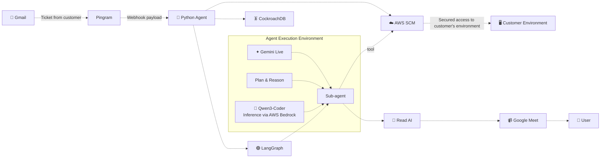

<!--  -->

 

 

 
 
 

<h1 align="center">
  Plato 
</h1>
  

    An Forward Deployed Engineer (FDE) agent that can connect with customer's production environment in real time. it can reason and debug the issue raised by customer. it can connect with google meet and interact with customer to exactly debug the issue
     
    

 
 

## Want a quick hands on ?

 

 

## End-to-End Demonstration

 

 

## Architecture (for humans - visually good version)

 

 

## Architecture (for AI Agents)

## Core Features

### > Live Customer Session Workspace

One shared interface for the entire support interaction — customer conversation, worker-agent activity, environment status, and audit trail, all visible in real time.

### > Dual-Agent Architecture

A conversation agent (Gemini Live) manages natural dialogue with the customer, while a separate worker agent (Groq-based, LangChain/LangGraph) handles technical investigation, tool planning, and debugging — keeping conversation and execution cleanly separated.

### > Tenant-Scoped Memory

Every customer is uniquely identified and mapped to their own history. The agent recalls prior sessions, previously attempted fixes, and past outcomes before starting a new investigation — powered by CockroachDB's distributed SQL and vector search.

### > Dynamic, Task-Scoped Tool Access

Tools available to the agent are generated per task, not fixed globally. Destructive or high-impact actions are restricted by default and require explicit approval.

### > Human-in-the-Loop Approval

Before any disruptive or irreversible action, the agent explains the action, its impact, and rollback options in plain language, and waits for explicit confirmation.

### > Time-Boxed, Auditable Access

Diagnostic sessions run against isolated sandbox environments with scoped, temporary access. Every command, approval, and result is logged for full auditability, and access is automatically revoked when the session ends.

### > Full Observability

Every conversation turn, tool call, planning step, and agent handoff is traced end-to-end via LangSmith, giving complete visibility into how each issue was investigated and resolved.

### > Cross-Session Pattern Detection

Semantic search over past incidents (via CockroachDB vector indexing) surfaces recurring issues across customers, helping teams spot systemic problems rather than treating every ticket as isolated.

### > Enterprise Admin Dashboard

Real-time visibility into active agent sessions, which customers are being served, common issues raised over time, and resolution outcomes — built for admin/ops oversight, not just end users.

 
 

---

---

### Developed with ❤️ by [Sai Nivedh](https://github.com/sainivedh26-sudo)
