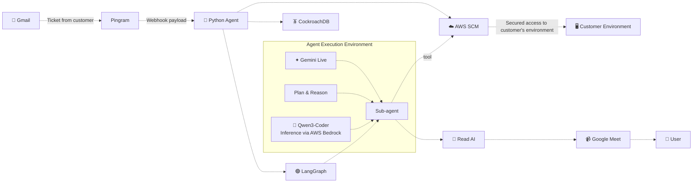

<!--  -->

<p align="center">

</p>

<br>


 


<br>
<br>
<br>

<h1 align="center">
  <font size="7">Plato </font>
</h1>
  <p align="center">
    An Forward Deployed Engineer (FDE) agent that can connect with customer's production environment in real time. it can reason and debug the issue raised by customer. it can connect with google meet and interact with customer to exactly debug the issue
    <br />
    </p>
</p>

<br>
<br>

## External apps used

1. CockroachDB
2. Aws SSM
3. ReadAI

## Want a quick hands on ? (demo video)

<br>

[](https://plato-topaz.vercel.app/)
<br>

## End-to-End Demonstration

<br>

[](https://www.loom.com/share/ce5512c7d0f348ef88dec622fcf5dc74)

<br>

## Architecture (for humans - visually good version)

<br>


<br>

## Architecture (for AI Agents)



<br>


## Core Features

### > Live Customer Session Workspace

One shared interface for the entire support interaction — customer conversation, worker-agent activity, environment status, and audit trail, all visible in real time.

### > Dual-Agent Architecture

A conversation agent (Gemini Live) manages natural dialogue with the customer, while a separate worker agent (Groq-based, LangChain/LangGraph) handles technical investigation, tool planning, and debugging — keeping conversation and execution cleanly separated.

### > Tenant-Scoped Memory

Every customer is uniquely identified and mapped to their own history. The agent recalls prior sessions, previously attempted fixes, and past outcomes before starting a new investigation — powered by CockroachDB's distributed SQL and vector search.

### > Dynamic, Task-Scoped Tool Access

Tools available to the agent are generated per task, not fixed globally. Destructive or high-impact actions are restricted by default and require explicit approval.

### > Human-in-the-Loop Approval

Before any disruptive or irreversible action, the agent explains the action, its impact, and rollback options in plain language, and waits for explicit confirmation.

### > Time-Boxed, Auditable Access

Diagnostic sessions run against isolated sandbox environments with scoped, temporary access. Every command, approval, and result is logged for full auditability, and access is automatically revoked when the session ends.

### > Full Observability

Every conversation turn, tool call, planning step, and agent handoff is traced end-to-end via LangSmith, giving complete visibility into how each issue was investigated and resolved.

### > Cross-Session Pattern Detection

Semantic search over past incidents (via CockroachDB vector indexing) surfaces recurring issues across customers, helping teams spot systemic problems rather than treating every ticket as isolated.

### > Enterprise Admin Dashboard

Real-time visibility into active agent sessions, which customers are being served, common issues raised over time, and resolution outcomes — built for admin/ops oversight, not just end users.

<br>
<br>

---

# Setup instructions

## Required Config Keys

Copy `.env.example` to `.env` and fill in the values:

```bash
cp .env.example .env
```

| Key | Description | Required |
|-----|-------------|----------|
| `ASSEMBLYAI_API_KEY` | AssemblyAI Speech-to-Text API key ([get key](https://www.assemblyai.com/)) | Yes (voice pipeline) |
| `CARTESIA_API_KEY` | Cartesia Text-to-Speech API key ([get key](https://cartesia.ai/)) | Yes (voice pipeline) |
| `GOOGLE_API_KEY` | Google Gemini API key ([get key](https://aistudio.google.com/)) | Yes |
| `AGENT_MODEL` | LLM model for agent (e.g. `google_genai:gemini-3.6-flash`) | No (defaults to `google_genai:gemini-3.6-flash`) |
| `COMPOSIO_API_KEY` | Composio API key for Google Calendar integration | Yes (Meet server) |
| `RECALL_API_KEY` | Recall.ai API key for meeting bots | Yes (Meet server) |
| `COCKROACH_CONNECTION_STRING` | CockroachDB/Postgres connection string | Yes (agent-connect-remote) |
| `AWS_ACCESS_KEY` | AWS access key for SSM managed instances | Yes (agent-connect-remote) |
| `AWS_SECRET_ACCESS_KEY` | AWS secret access key | Yes (agent-connect-remote) |
| `BACKEND_URL` | Public ngrok URL (e.g. `https://your-url.ngrok-free.dev`) | Yes (webhooks) |
| `PINGRAM_API_KEY` | Pingram API key for email notifications ([get key](https://app.pingram.io/environments)) | Yes (agent-connect-remote) |
| `LANGSMITH_TRACING` | Enable LangSmith tracing (`true`/`false`) | No |
| `LANGSMITH_API_KEY` | LangSmith API key for observability | Optional |
| `LANGFUSE_SECRET_KEY` | Langfuse secret key for tracing | Optional |
| `LANGFUSE_PUBLIC_KEY` | Langfuse public key | Optional |
| `LANGFUSE_BASE_URL` | Langfuse base URL | Optional |

---

## Install Dependencies

```bash
pip install -r requirements.txt
```

---

## Run Commands


### Agent Connect Remote (main backend with Pingram webhook)

```bash
uvicorn main:app --host 0.0.0.0 --port 8000
```

Run from the `agent-connect-remote/` directory.

### Dashboard

```bash
python3 dashboard/server.py
```

Serves enterprise dashboard on port `8002`.

### Expose webhook via ngrok

```bash
ngrok http 8000
```

Update `BACKEND_URL` in `.env` with the ngrok URL. Set the Pingram webhook URL to:
```
https://<your-ngrok-url>.ngrok-free.dev/webhook/pingram
```

---

## Debugging scripts

### Gemini Live Token Server

```bash
python3 live_server.py
```

Serves ephemeral Gemini tokens on port `8001`.

### Meet Server (Google Meet + Recall bots)

```bash
python3 meet_server.py
```

Serves on port `8002` (configurable via `MEET_SERVER_PORT`).

### Voice Agent (FastAPI + WebSocket pipeline)

```bash
uvicorn app:app --host 0.0.0.0 --port 8000
```


---

# Reliability Testing

I've tested the reliability of the Plato by running it with various configurations and monitoring its performance over time. it can reason and solve issues on a remote server on common kubenetes clusters, docker containers, webapps, package installationsand more. anything that doesn't require visual interaction. if it encounters an issue, it can safely wrap up the session with customer and hand it over to a human FDE. 

I have made it to moved beyond simple ticket automation and focused on live investigation inside a customer-specific environment. I also had to balance useful debugging access with security: the agent needed to inspect and modify a sandbox, but it could not receive unrestricted shell access.

Human approval was another challenge. Technical commands had to be translated into clear explanations of impact, reversibility, and risk so that a non-technical customer could make an informed decision. I also had to coordinate two agents without losing context or accidentally duplicating tool calls.

I'm definitely proud of building a solution that can help FDEs investigate issues faster while remaining scoped, auditable, time-limited, and revocable. Plato is designed to reduce repeated diagnostic work, shorten time to resolution, and increase the number of customer environments an FDE can support in parallel.

I have also made tenant memory part of the visible experience, separated conversation from technical execution, and used CockroachDB for both transactional state and semantic incident memory.(provides distributed transactional database - ideal for handling high volume of concurrent transactions) Instead of maintaining a separate vector database, the system keeps customer history, live workflow state, approvals, tool activity, and searchable incident context in a single and distributed database.

since i had some free credits, i was able to test on the servers from the following providers


---


### Developed with ❤️ by [Sai Nivedh](https://github.com/sainivedh26-sudo)
